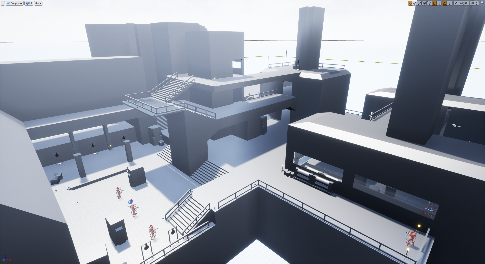
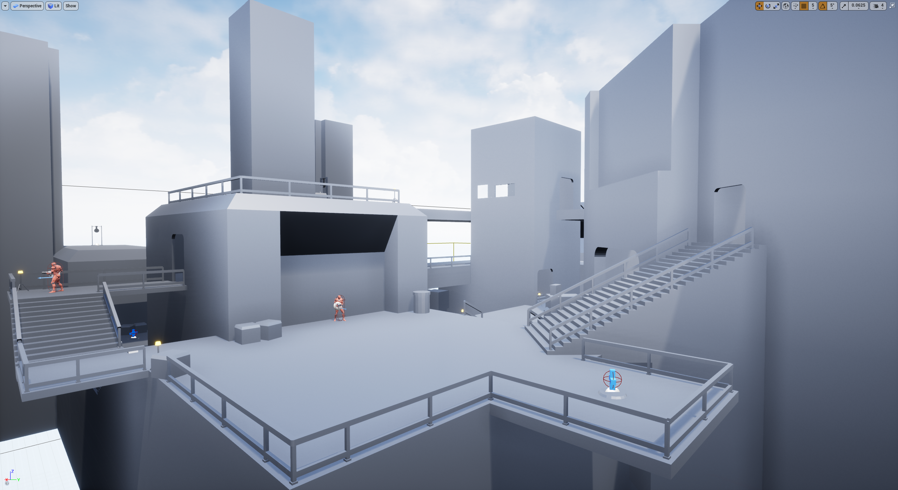
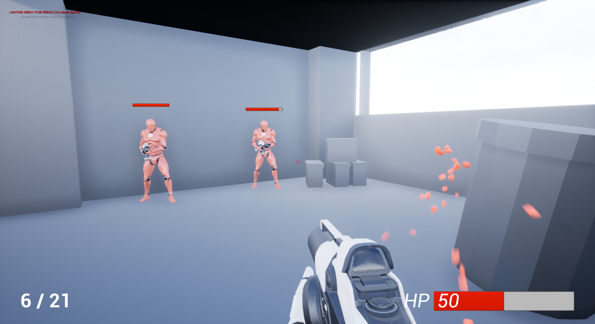
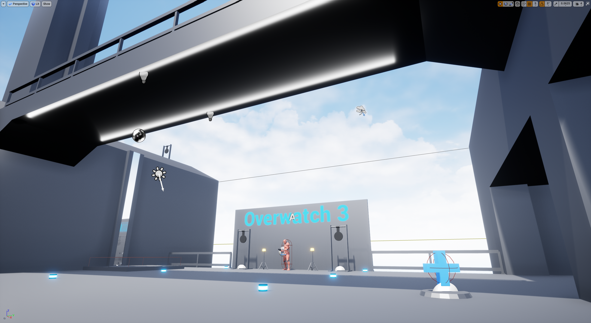
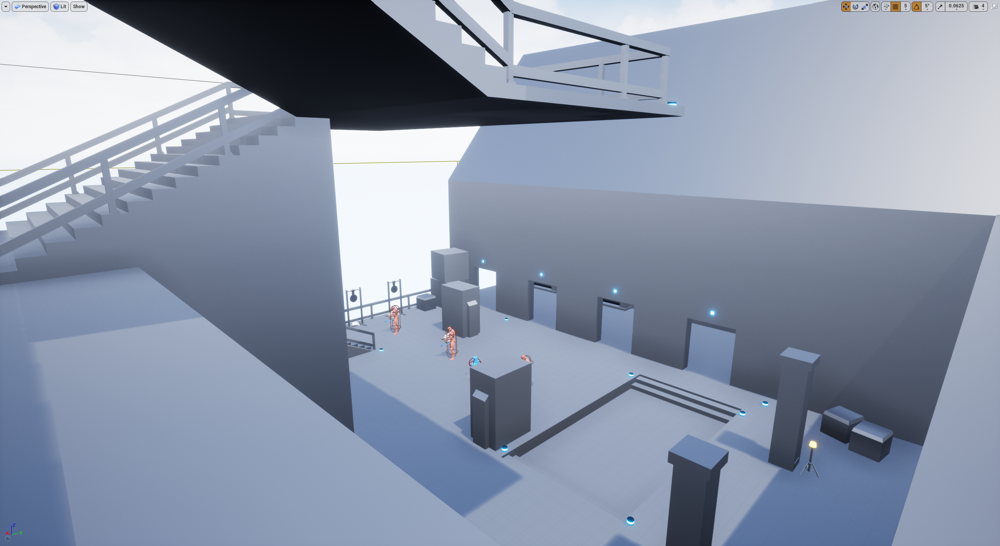

# Overwatch 3

Overwatch 3 is my hobby project developed with ONLY Unreal Engine 4 Blueprint. I became so sick of Overwatch 2 delays that I decided to start developing Overwatch 3 myself. Hopefully before year 2030 I'll finish this grand project for people to play when they still don't have access to Overwatch 2. JK.

(Another C++ Unreal project is [here](https://github.com/legenary/UE4_CppDemo).)

(I also have two C++ projects using [Bullet physics engine](https://pybullet.org/wordpress/) (an open source physics engine both for making games and robotics research) [here (MuscleModel)](https://github.com/legenary/MuscleModel), and [here (WhiskerModel)](https://github.com/legenary/WhiskerModel).)

Okay so basically this is my practice to rebuild some of the features in Overwatch using Unreal Engine 4, including a basic layout for the practice range, some AI enemies, a basic UI and handful of heros in the hopefully near future. 

I'm not a good environment artist so the aesthetic is kept to minimum. After it started, you can navigate yourself in the map and try out different stuff, attack the Ai enemy, pick up health packs, and don't forget, you can change character in the menu by pressing keyboard `H`.

## 1. HUD

The game HUD is easy and simple. 

Character current ammo is on bottom left, reducing by 1 each time the character fires. The character cannot fire when the ammo is 0 and has to reload (`R`) after which ammo returns to full.

## 2. Character switching menu

The user is able to switch the character by pressing `H` and select different characters in the pop up menu. There are two characters now just for testing but more coming.

<b>Default:</b> 

This is a default Epic first person character. The type of ammo is a yellow projectile that bounces back at environment surfaces and deals damage when it hits other characters in the map. Maximum ammo: 5.

<b>Soidler: </b> 

This is a typical hitscan character. It shoots at wherever the crosshair is pointing to, despite of distance. The type of ammo is blue bullet that destroy itself no matter what it hits. It deals damage to other characets in the map. Maximum ammo: 21.

## 3. Enemy

Like in Overwatch practice range, there are also standing enemies in the shooting range that keeps shooting, only they shoot when the player is in sight. 

They have floating health bars above the top of their head, visible to the player character in a limited range. The player character can deal damage and kill an emeny by shooting at them. The enemy will respawn at the location where it was killed several seconds after the death animation.

## 4. Shooting range

The shooting range section of the map contains a basic elevator, activated when stepped on by the player character. The shooting range also contains several shooting tragets with the target itself physics enabled, i.e. the target will rotate when impulse from bullets are imposed. 

Some enemy AIs will shoot every several seconds when the player character is in its sight. The enemy will be able to deal damage to the player character if the player character is shot. 

The shooting range also have one health patch that can restore 25 HP to the player character when consumed by overlapping. The heal pack respawn after 2 seconds. The health pack will not be able to be comsumed if the player HP is maximum (100).

## 5. Playground

Playground has a different architercture with several roaming enemy AI running back and forth following preset way points. The player character can also deal damages to these AIs. They will also respawn at the location of being killed and continue to roam between way points as the previous AI.

